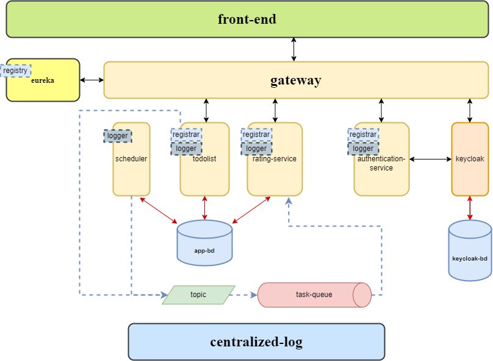

# Microservices Todolist Application
This is an application that is created using a microservice architecture.

## Dependencies

* Spring Boot, Spring Data, Spring Cloud, Spring Security
* OAuth 2.0, KeyCloak
* ELK Stack
* Postgres, LiquidBase
* RabbitMQ
* Docker
* Gradle
* Git

# General Information
This application offers the following features:
* User registration and authentication
* Managing tasks
* Gain points and compete with others

## Non-functional requirements
* JDK 17+;
* Docker-Compose / Docker
# Get started
* `cd docker`
* `docker compose up -d --build`

After launching all the containers, the application will be accessible via the following [link](http://localhost:3000/).

## Project architecture

## Authors
- [@Viktor Sinkevich](https://github.com/Viktorsee0/)
- [@Jan Dubovsky](https://github.com/PanDubovskij)
